```{=latex}
\begin{titlepage}
\thispagestyle{empty}
\vspace*{0.24\textheight}
\begin{center}
{\setlength{\fboxsep}{16pt}\colorbox[HTML]{184F3D}{\textcolor{white}{\fontsize{20}{20}\selectfont\bfseries PP}}}

\vspace{1.2cm}
{\fontsize{30}{34}\selectfont\bfseries Pharma\par}
\vspace{0.15cm}
{\fontsize{30}{34}\selectfont\bfseries Plan\par}
\vspace{0.45cm}
{\Large TPZ Muhen\par}

\vfill
{\large Built by Speats\par}
\end{center}
\end{titlepage}
\newpage
```

Dokumentversion: 1.1  
Status: vollstaendige Entwurfsversion, bereit fuer die finale Pruefung  
Produkt: Pharma Plan Pro  
Zielgruppe: operative Benutzer und Administratoren

---

## 1. Einleitung

Pharma Plan Pro ist eine Plattform fuer Personalverwaltung und operative Einsatzplanung.  
Das System unterstuetzt die wichtigsten taeglichen Aufgaben rund um Schichtplanung, Abwesenheitsverwaltung, Vertretungsanfragen und die Pflege der Mitarbeiterstammdaten.

Die wichtigsten Funktionen sind:

- Einsicht in das operative Dashboard
- Anzeige und Verwaltung des Schichtkalenders
- Generierung der Monatsplanung
- Verwaltung der Mitarbeiterstammdaten
- Konfiguration wiederkehrender Verfuegbarkeiten
- Erfassung von Abwesenheiten
- Verwaltung von Vertretungsanfragen
- Verwaltung von Schulungen und Kursen
- Konfiguration der Deckungsregeln
- Genehmigung und Verwaltung von Benutzern

{ width=95% }

### 1.1 Rollen Und Berechtigungen

Die verfuegbaren Funktionen haengen vom Benutzerprofil ab.

- Standardbenutzer haben nur Zugriff auf die fuer ihr Konto freigegebenen Bereiche.
- Administratoren verfuegen zusaetzlich ueber Funktionen fuer Konfiguration, Datenerfassung und Benutzerverwaltung.

Im Handbuch werden Funktionen, die Administratoren vorbehalten sind, im Text ausdruecklich kenntlich gemacht.

---

## 2. Zugriff Auf Das System

### 2.1 Anmeldung

So greifen Sie auf die Plattform zu:

1. die Anmeldeseite oeffnen
2. E-Mail-Adresse und Passwort eingeben
3. auf die Schaltflaeche zur Anmeldung klicken

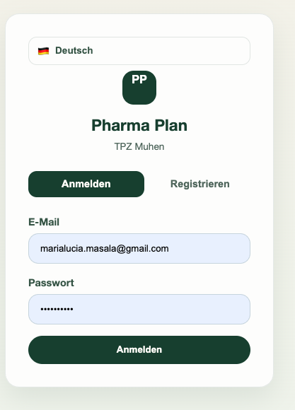{ width=95% }

Auf der Anmeldeseite stehen in der Regel folgende Elemente zur Verfuegung:

- Feld fuer E-Mail
- Feld fuer Passwort
- Schaltflaeche zur Anmeldung
- Link zur Registrierung
- Sprachumschalter

### 2.2 Registrierung

Wenn die Registrierung aktiviert ist, kann ein neuer Benutzer sein Konto anlegen, indem die angeforderten Daten eingegeben werden.

Typischer Ablauf:

1. die Registrierungsseite oeffnen
2. vollstaendigen Namen, E-Mail und Passwort eingeben
3. die Kontoerstellung bestaetigen

{ width=95% }

---

## 3. Uebersicht Der Benutzeroberflaeche

Nach der Anmeldung gelangt der Benutzer in die Hauptoberflaeche der Anwendung.

{ width=95% }

### 3.1 Aufbau Der Seite

Die Oberflaeche besteht aus:

- einem Seitenmenue mit den verfuegbaren Bereichen
- einem zentralen Inhaltsbereich fuer die aktive Seite
- einem unteren Bereich mit Informationen zum angemeldeten Benutzer
- der Abmeldeschaltflaeche
- der Sprachumschaltung

### 3.2 Navigationsmenue

Abhaengig von den Berechtigungen koennen folgende Bereiche sichtbar sein:

- Dashboard
- Schichten
- Planung
- Deckungsregeln
- Mitarbeiter
- Verfuegbarkeit
- Abwesenheiten
- Vertretungsanfragen
- Schulungen
- Benutzerverwaltung

---

## 4. Dashboard

Das Dashboard ist der operative Einstiegspunkt der Anwendung.  
Es bietet einen kompakten Ueberblick ueber die aktuelle Situation, ohne sofort in die einzelnen Bereiche wechseln zu muessen.

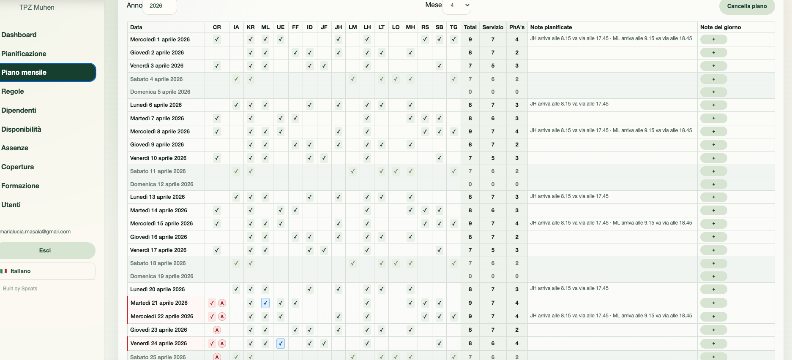{ width=95% }

### 4.1 Verfuegbare Informationen

Das Dashboard kann unter anderem anzeigen:

- die Anzahl aktiver Mitarbeiter
- die Anzahl der Abwesenheiten im aktuellen Zeitraum
- die Anzahl der in der laufenden Woche registrierten Schichten
- geplante Notizen des Tages
- Hinweise auf kritische Deckung oder Probleme

### 4.2 Empfohlene Nutzung

Das Dashboard ist besonders hilfreich, um:

- die Situation des Tages oder der Woche schnell zu pruefen
- Auffaelligkeiten zu erkennen, bevor der Plan geaendert wird
- operative Hinweise und Notizen sofort zu sehen

---

## 5. Schichten

Im Bereich **Schichten** kann der operative Monatskalender eingesehen werden. Administratoren koennen zusaetzlich manuell in die Zuteilungen eingreifen.

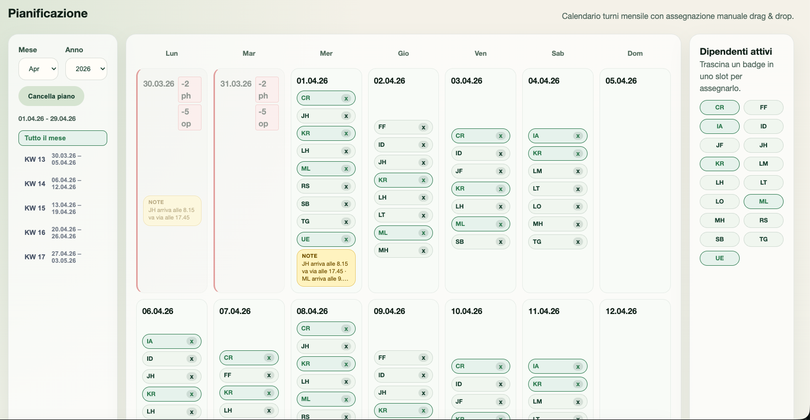{ width=95% }

### 5.1 Auswahl Des Zeitraums

Im oberen Bereich der Seite stehen Steuerelemente zur Verfuegung, um:

- den Monat auszuwaehlen
- das Jahr auszuwaehlen
- den Monatsplan zu generieren, falls noch keiner vorhanden ist
- den Monatsplan zu loeschen, falls erforderlich

### 5.2 Lesen Des Kalenders

Jede Kalenderzelle steht fuer einen Tag.  
Innerhalb eines Tages koennen angezeigt werden:

- zugewiesene Mitarbeiter
- Deckungs-Badges
- Abwesenheitsmarker
- operative Notizen

Tage mit kritischen Situationen werden visuell hervorgehoben, damit Probleme leichter erkannt werden.

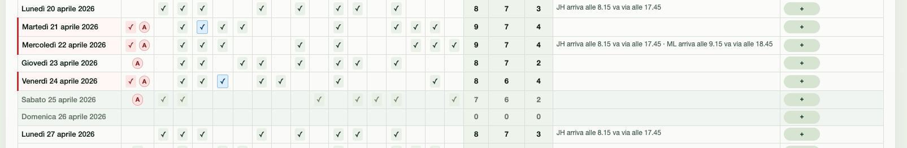{ width=95% }

### 5.3 Wochenfilter

Die Ansicht bietet eine Liste von `KW`, mit der nur eine einzelne Kalenderwoche des Monats angezeigt werden kann.

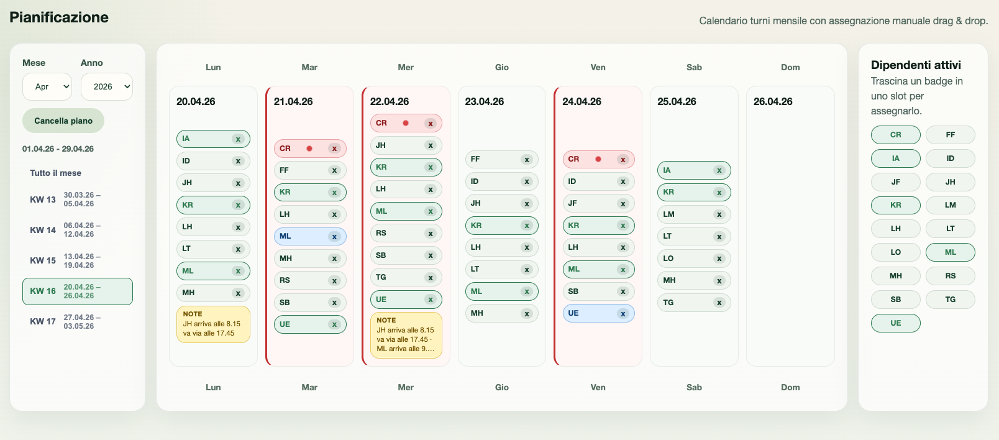{ width=95% }

Diese Funktion ist hilfreich, wenn man:

- sich auf einen kleineren Zeitraum konzentrieren moechte
- eine bestimmte Woche pruefen will
- die Kontrolle der Zuteilungen vereinfachen moechte

### 5.4 Manuelle Schichtzuweisung

Administratoren koennen einen Mitarbeiter manuell zuweisen, indem sie ihn aus dem Seitenbereich auf einen Tag im Kalender ziehen.

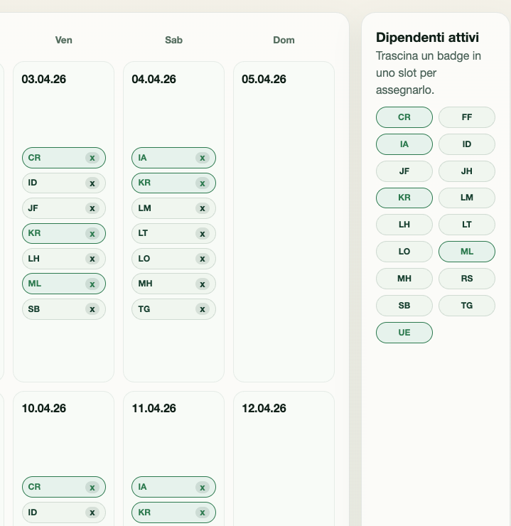{ width=95% }

Empfohlene Vorgehensweise:

1. den Mitarbeiter im Seitenbereich suchen
2. ihn auf den gewuenschten Tag ziehen
3. innerhalb der Tageszelle ablegen

Eine Schicht kann entfernt werden, indem:

- der Loeschbefehl direkt an der Zuteilung verwendet wird
- oder die Zuteilung in den dafuer vorgesehenen Entfernungsbereich gezogen wird

### 5.5 Notizen Und Visuelle Hinweise

Im Kalender koennen unterschiedliche operative Zustaende erscheinen, darunter:

- automatisch generierte Schicht
- manuell eingetragene Schicht
- durch Vertretung abgedeckte Schicht
- Konflikt
- Abwesenheit des zugewiesenen Mitarbeiters
- geplante oder taegliche Notizen

Die korrekte Interpretation dieser Hinweise erleichtert das Verstaendnis der Planqualitaet und der Ursache moeglicher Probleme.

---

## 6. Monatsplanung

Der Bereich **Planung** bietet eine detaillierte Tabellenansicht des Monats und eignet sich fuer die genaue Kontrolle der taeglichen Zuteilungen.

{ width=95% }

### 6.1 Aufbau Der Tabelle

Fuer jedes Datum kann die Tabelle Folgendes anzeigen:

- Zuteilung einzelner Mitarbeiter
- Gesamtzahl anwesender Ressourcen
- Gesamtzahl `Bediener`
- Gesamtzahl `PhA's`
- wiederkehrende geplante Notizen
- spezifische Tagesnotizen

Diese Ansicht eignet sich fuer operative Kontrollen, numerische Pruefungen und den schnellen Vergleich verschiedener Tage.

### 6.2 Plan Generieren

Wenn fuer den ausgewaehlten Monat noch keine Planung vorhanden ist, kann der Administrator die Schaltflaeche `Genera` verwenden.

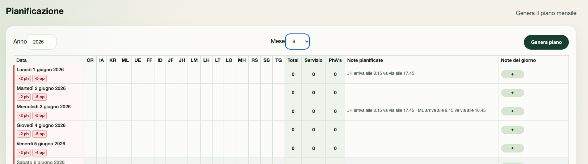{ width=95% }

Die automatische Generierung beruecksichtigt die im System verfuegbaren Konfigurationen, einschliesslich Stammdaten, Verfuegbarkeiten, Abwesenheiten und Deckungsregeln.

### 6.3 Plan Loeschen

Wenn ein Monatsplan neu erstellt werden muss, kann der Administrator den Befehl `Cancella piano` verwenden.

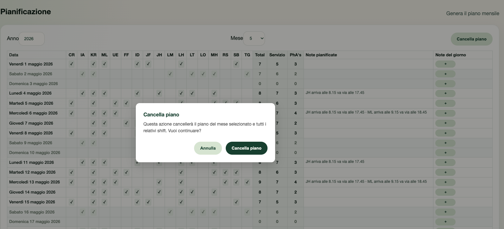{ width=95% }

Diese Aktion entfernt die Zuteilungen des ausgewaehlten Monats und sollte daher nur bei Bedarf ausgefuehrt werden.

### 6.4 Tagesnotizen

Fuer jeden Tag kann das Fenster zur Bearbeitung der Tagesnotiz geoeffnet werden.

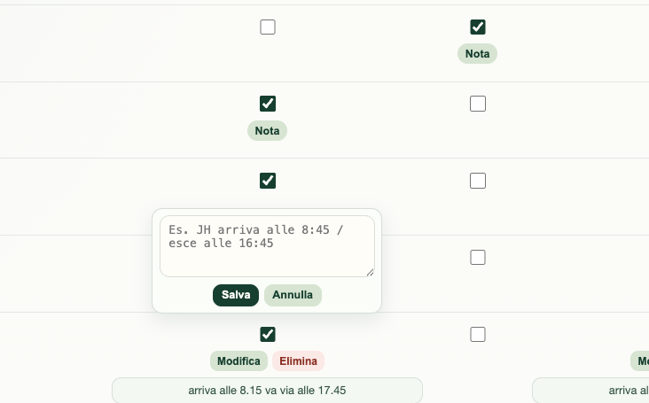{ width=95% }

Tagesnotizen koennen genutzt werden, um Folgendes festzuhalten:

- organisatorische Hinweise
- interne Erinnerungen
- operative Ausnahmen fuer einen bestimmten Tag

---

## 7. Mitarbeiterverwaltung

Der Bereich **Mitarbeiter** ist fuer die Stammdaten des Personals vorgesehen.

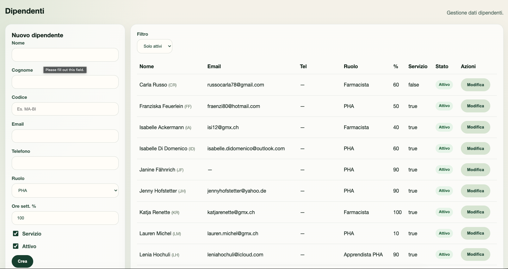{ width=95% }

### 7.1 Neuen Mitarbeiter Anlegen

Im Eingabeformular stehen die wichtigsten operativen Felder zur Verfuegung:

- Vorname
- Nachname
- angezeigter Code
- E-Mail
- Telefon
- Rolle
- Prozent der Wochenarbeitszeit
- aktiv oder inaktiv
- Kennzeichen `Bediener`

Vorgehensweise:

1. die erforderlichen Felder ausfuellen
2. die eingegebenen Daten pruefen
3. die Speicherung bestaetigen

### 7.2 Mitarbeiter Bearbeiten

In der Tabelle kann ein bereits angelegter Mitarbeiter zur Bearbeitung geoeffnet werden.

Haeufige Aenderungen betreffen:

- Aktualisierung der Stammdaten
- Aktualisierung der Kontaktdaten
- Aenderung der Rolle
- Aenderung des Arbeitspensums
- Aktivierung oder Deaktivierung des Mitarbeiters

### 7.3 Filter Der Liste

Die Liste kann gefiltert werden, um:

- nur aktive Mitarbeiter
- alle Mitarbeiter

anzuzeigen.

Diese Unterscheidung hilft dabei, historische Daten zu behalten, ohne die operative Lesbarkeit zu beeintraechtigen.

---

## 8. Verfuegbarkeit

Im Bereich **Verfuegbarkeit** wird die wiederkehrende Verfuegbarkeit des Personals fuer jeden Wochentag definiert.

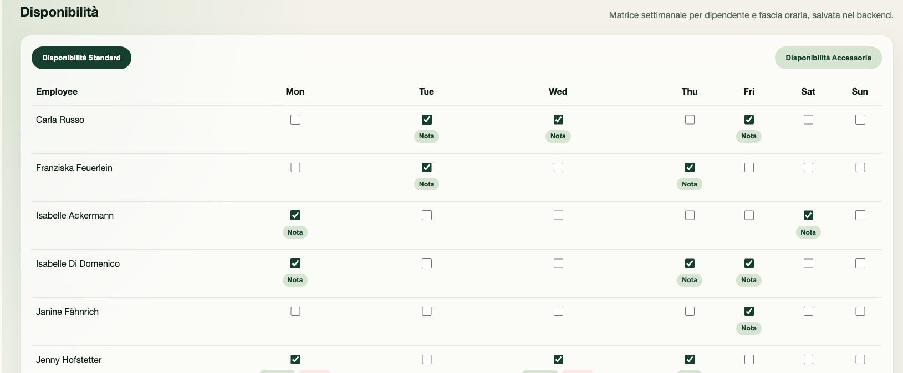{ width=95% }

### 8.1 Standardverfuegbarkeit

Die Registerkarte **standard** beschreibt das uebliche wiederkehrende Verfuegbarkeitsmuster eines Mitarbeiters.

Fuer jeden Mitarbeiter und fuer jeden Wochentag kann:

- die Verfuegbarkeit aktiviert
- die Verfuegbarkeit deaktiviert

werden.

Diese Einstellung bildet die Grundlage fuer die Planung.

### 8.2 Zusatzverfuegbarkeit

Die Registerkarte **accessoria** ermoeglicht die Verwaltung zusaetzlicher Verfuegbarkeiten.

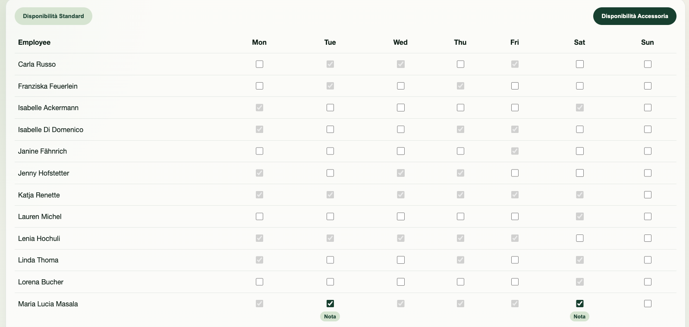{ width=95% }

Diese Ansicht ist hilfreich, wenn:

- ein Mitarbeiter zusaetzliche Tage abdecken kann
- wiederkehrende Ausnahmen gepflegt werden sollen
- Unterstuetzungs- oder Verstaerkungsszenarien abgebildet werden sollen

### 8.3 Besondere Hinweise Zur Verfuegbarkeit

Zu einer aktiven Verfuegbarkeit kann eine spezielle Notiz hinterlegt werden.

{ width=95% }

Notizen koennen verwendet werden, um:

- Einschraenkungen
- Praeferenzen
- besondere Bedingungen fuer den Tag

zu beschreiben.

---

## 9. Abwesenheiten

Im Bereich **Abwesenheiten** werden alle Nichtverfuegbarkeiten des Personals erfasst und ueberwacht.

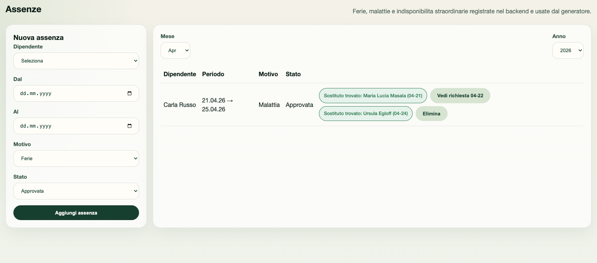{ width=95% }

### 9.1 Neue Abwesenheit Erfassen

Zum Erfassen einer Abwesenheit:

1. Mitarbeiter auswaehlen
2. Start- und Enddatum eingeben
3. Grund waehlen
4. Status festlegen
5. speichern

### 9.2 Verfuegbare Typen

Zu den haeufigsten Abwesenheitsarten gehoeren:

- Ferien
- nicht verfuegbar
- Krankheit
- Schule
- Schulung
- HR-Gespraech

### 9.3 Abwesenheiten Einsehen

Die Tabelle zeigt unter anderem:

- betroffenen Mitarbeiter
- Abwesenheitszeitraum
- Grund
- Status
- gegebenenfalls den Status der Vertretung

Die Ansicht enthaelt Filter fuer Monat und Jahr und eignet sich damit fuer eine gezielte Uebersicht.

### 9.4 Abwesenheit Loeschen

Wenn eine Abwesenheit irrtuemlich erfasst wurde oder nicht mehr gueltig ist, kann sie geloescht werden.

Wenn mit der Abwesenheit Vertretungsanfragen oder bereits angelegte Ersatzschichten verknuepft sind, aktualisiert das System die betroffenen Elemente entsprechend.

### 9.5 Vertretungsanfrage Starten

Wenn die Abwesenheit einen bereits besetzten Tag betrifft, kann der Administrator eine Vertretungsanfrage starten.

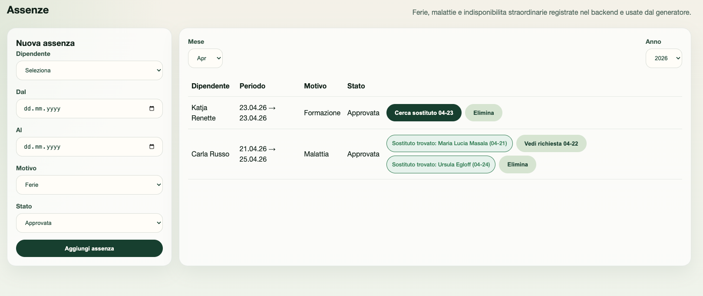{ width=95% }

Von dieser Ansicht aus kann man:

- die Kandidatensuche starten
- eine bereits geoeffnete Anfrage pruefen
- kontrollieren, ob bereits ein Ersatz gefunden wurde

---

## 10. Vertretungsanfragen

Im Bereich **Vertretungsanfragen** werden alle Anfragen gesammelt, die aufgrund von Abwesenheiten oder offenen Schichten erzeugt wurden.

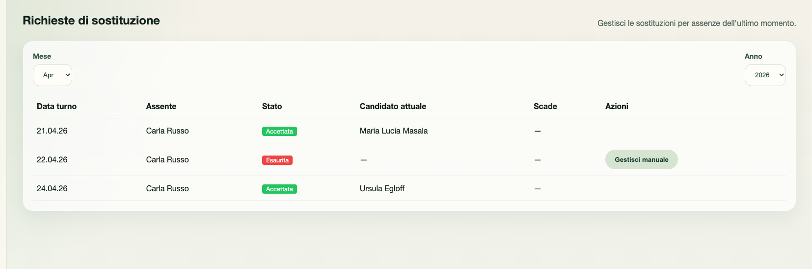{ width=95% }

### 10.1 Angezeigte Informationen

Fuer jede Anfrage werden in der Regel angezeigt:

- Schichtdatum
- abwesender Mitarbeiter
- Status der Anfrage
- aktueller Kandidat
- verbleibende Zeit oder Frist
- verfuegbare Aktionen

### 10.2 Operative Status

Je nach Verlauf der Anfrage koennen folgende Status erscheinen:

- ausstehend
- Vorschlag gesendet
- akzeptiert
- erschoepft
- storniert

### 10.3 Verfuegbare Aktionen

Abhaengig vom Status kann der Administrator:

- die Anfrage erneut senden
- die Anfrage abbrechen
- manuell eingreifen

### 10.4 Manuelle Bearbeitung

Wenn der automatische Ablauf keine geeignete Loesung findet, kann eine manuelle Bearbeitung erfolgen.

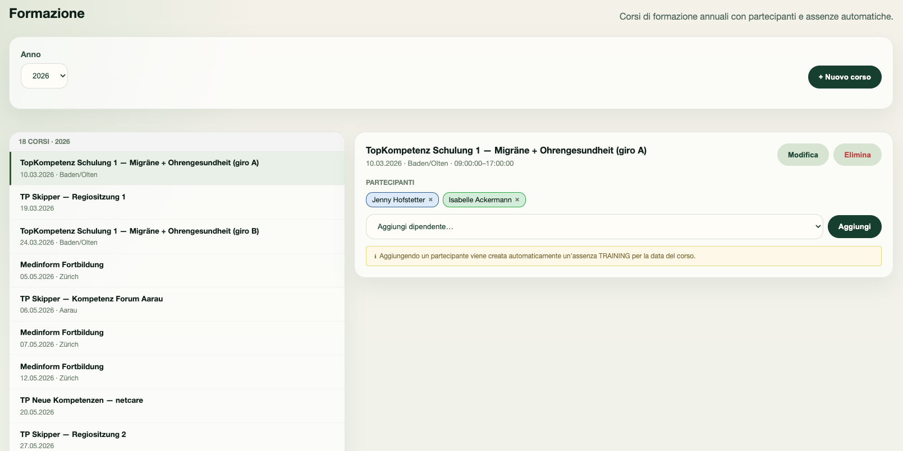{ width=95% }

Diese Funktion ist besonders in Ausnahmefaellen oder bei sofortigem organisatorischem Handlungsbedarf sinnvoll.

---

## 11. Schulungen

Im Bereich **Schulungen** werden Kurse, Schulungstermine und Teilnehmer verwaltet.

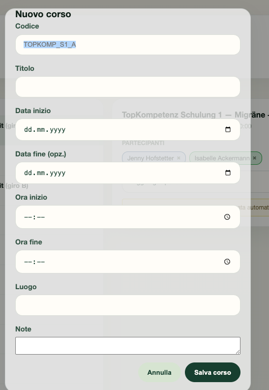{ width=95% }

### 11.1 Kurs Anlegen

Fuer jeden Kurs koennen unter anderem folgende Daten definiert werden:

- Code
- Titel
- Startdatum
- Enddatum
- Uhrzeit
- Ort
- Notizen

### 11.2 Kurs Einsehen Und Bearbeiten

Die Kursliste befindet sich in der Regel auf der linken Seite, waehrend die Details des ausgewaehlten Kurses auf der rechten Seite angezeigt werden.

Zu den verfuegbaren Aktionen gehoeren:

- Bearbeiten der Kursdaten
- Loeschen des Kurses
- Einsehen des Zeitplans und der Teilnehmer

### 11.3 Teilnehmerverwaltung

Fuer jeden Kurs koennen Sie:

- einen Teilnehmer hinzufuegen
- einen Teilnehmer entfernen
- die vollstaendige Teilnehmerliste einsehen

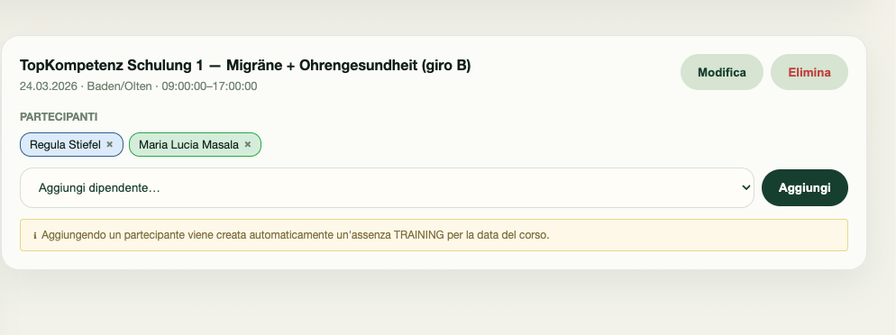{ width=95% }

Das Hinzufuegen eines Teilnehmers kann automatisch eine entsprechende Abwesenheit vom Typ Schulung erzeugen.

---

## 12. Deckungsregeln

Im Bereich **Deckungsregeln** werden die minimal erforderlichen Personalzahlen fuer die einzelnen Wochentage festgelegt.

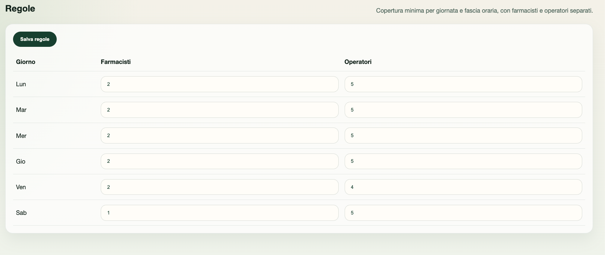{ width=95% }

### 12.1 Zweck Der Ansicht

Die Deckungsregeln definieren die Mindestanzahl an benoetigten Ressourcen, zum Beispiel:

- Apotheker
- Operatoren

### 12.2 Werte Aktualisieren

Um die Regeln zu aendern:

1. die numerischen Werte in der Tabelle anpassen
2. die Aenderungen speichern

Die konfigurierten Regeln beeinflussen die Erkennung kritischer Situationen und die automatische Generierung des Plans.

---

## 13. Benutzerverwaltung

Der Bereich **Benutzerverwaltung** ist Administratoren vorbehalten.

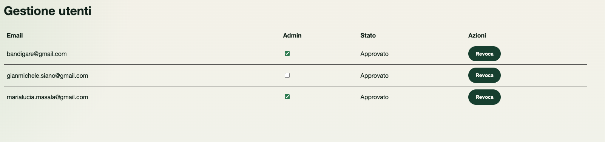{ width=95% }

### 13.1 Verfuegbare Funktionen

Auf dieser Seite kann man:

- registrierte Benutzer einsehen
- Administratorrechte vergeben oder entziehen
- den Status eines Kontos kontrollieren

### 13.2 Operativer Einsatz

Diese Seite wird insbesondere genutzt, wenn:

- ein neuer Benutzer angelegt wurde
- Zugriffsrechte angepasst werden muessen
- ein Konto eingeschraenkt oder erweitert werden soll

---

## 14. Haeufige Probleme

### 14.1 Anmeldung Nicht Moeglich

Pruefen Sie:

- ob E-Mail-Adresse und Passwort korrekt sind
- ob Tippfehler vorliegen
- ob das richtige Konto verwendet wird

### 14.2 Ein Mitarbeiter Ist In Den Operativen Ansichten Nicht Sichtbar

Pruefen Sie:

- ob der Mitarbeiter in den Stammdaten vorhanden ist
- ob er als aktiv markiert ist
- ob die Verfuegbarkeit korrekt konfiguriert wurde

### 14.3 Der Plan Laesst Sich Nicht Generieren

Pruefen Sie:

- den ausgewaehlten Monat und das Jahr
- die Konsistenz der Verfuegbarkeiten
- vorhandene Abwesenheiten
- die Richtigkeit der Deckungsregeln

### 14.4 Eine Vertretungsanfrage Ist Abgelaufen

Oeffnen Sie den Bereich Vertretungsanfragen und pruefen Sie, ob eine erneute Aussendung oder eine manuelle Bearbeitung verfuegbar ist.

### 14.5 Ein Kurs Oder Teilnehmer Wird Nicht Korrekt Angezeigt

Pruefen Sie:

- ob der Kurs gespeichert wurde
- ob der Teilnehmer korrekt zugeordnet wurde
- ob die zugehoerige Abwesenheit vom Typ Schulung angelegt wurde

---

## 15. Glossar

### Schicht

Zuweisung eines Mitarbeiters zu einem bestimmten Arbeitstag.

### Planung

Strukturierte Monatsansicht mit Zuteilungen, Summen und operativen Notizen.

### Standardverfuegbarkeit

Uebliche wiederkehrende Verfuegbarkeit eines Mitarbeiters.

### Zusatzverfuegbarkeit

Ergaenzende Verfuegbarkeit zusaetzlich zur Standardverfuegbarkeit.

### Abwesenheit

Zeitraum, in dem ein Mitarbeiter nicht fuer die Arbeit verfuegbar ist.

### Vertretung

Prozess zur Suche und Verwaltung eines Ersatzes fuer eine offene Schicht.

### Ersatzmitarbeiter

Mitarbeiter, der die Schicht eines abwesenden Kollegen uebernimmt.

### Tagesnotiz

Operative Nachricht, die einem bestimmten Datum zugeordnet ist.

---

## 16. Hinweise Fuer Die Finale Version

Vor dem Export in PDF wird empfohlen:

- zu pruefen, dass alle verlinkten Screenshots korrekt angezeigt werden
- sicherzustellen, dass die Bezeichnungen der Schaltflaechen mit der Anwendung uebereinstimmen
- gegebenenfalls interne Begriffe des Unternehmens zu vereinheitlichen
- das Datum der letzten Aktualisierung des Dokuments zu ergaenzen
- bei Bedarf ein Firmenlogo oder eine Kopfzeile einzufuegen

---

## 17. Finale Pruefliste

- alle Screenshots sind vorhanden und werden korrekt geladen
- die Abschnittstitel sind korrekt und einheitlich
- die Terminologie ist im gesamten Dokument konsistent
- die beschriebenen Bedienablaeufe entsprechen der realen Anwendung
- das finale PDF wurde vor der Weitergabe visuell geprueft
